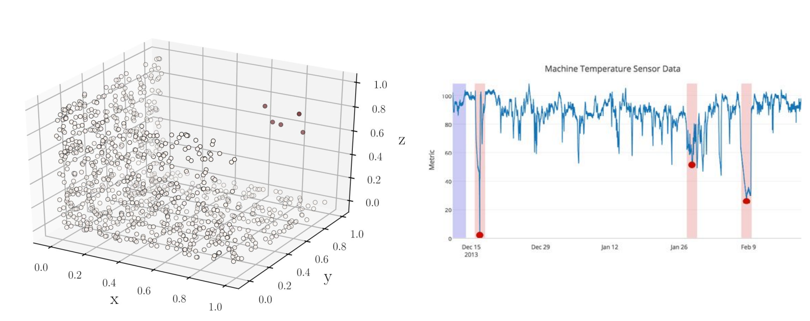

# 异常（Anomaly）

学习DLAD，最先要理解的概念是Anomaly。Anomaly，即异常，可以理解成偏离预期数据模式的数据点。如下面两幅图：

在左图的右上方有几个零散的数据点明显偏离于大部分数据点，右图标红色的三个点的位置明显低于其附近的点，我们称这些数据点为异常。

当我们要定义Anomaly的时候需要定义三个因素：expected data pattern, distance function和threshold。The expected data pattern是指预期的数据模式，即定义一个标准去衡量在怎么样的一个范围数据算正常。The distance function是距离函数，这是一种测量数据点点到点之间的距离。The threshold是阈值，即定义一个值与得到的距离进行比较，以此判断该点属于正常范围还是异常范围。

# 异常检测（Anomaly Detection）

Anomaly Detection，即异常检测，可以识别给定数据集中的异常标签。 举一个非常简单的例子，在二维平面上，我们规定以原点为圆心，以1为半径的园内（包括边缘）为正常数据，那么我们就可以定义一个异常检测算法Anomaly if {$d: x^{2}+y^{2}>1$},这个算法就用到了上述定义异常的三个因素。

# 应用

异常检测有众多的应用。如入侵检测，可以以账户的访问日志为数据集，分析网络中未经授权的访问权限；欺诈检测，可以以账户的交易记录为数据集，分析可能具有欺诈性质的应用软件；医疗诊断，以医学图像为数据集，分析病变现象；自动驾驶汽车开发，以传感器（如雷达）传入的数据，分析路况的异常帮助做出决断……

# 挑战

传统的异常检测面临很多挑战，最显著的是无法使用fully supervised approaches。一方面是anomalies的labels是比较稀少的，通常要人工完成，这里的人工成本就非常高了。另一方面是anomalies本身就是稀少的，正常和异常数据是极度不平衡的这点是显而易见的。除此之外还有其他的问题，例如异常检测需要学习正常数据高维度的数据模式；异常的界定是随着不同情况下会产生主观改变的，很难去标定一个异常检测算法对大部分应用场景下都有效；正常与异常的界定往往不好明确标定……

