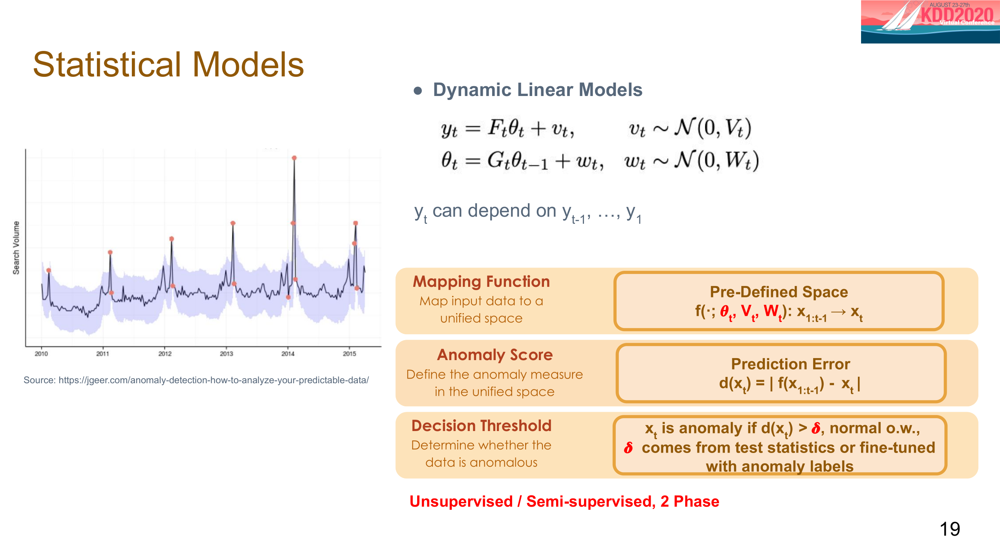

# 传统算法（Traditional Algorithms）

传统的异常检测算法有三类，分别是Classification, Distance-Based和Statistical Models。不同的算法分类有相同的步骤构成。

第一步是Learn Data Representation，即学习一个映射函数（mapping function），然后将input映射进一个统一的空间，这个空间可以是预定义好的，我们知道其具体意义的空间，也可以是一个潜在的空间，我们可能不知道其物理意义。

第二步是Detect Anomaly，这里用到的就是前面提及的定义，我们需要Anomaly Score来评估异常程度，以及需要Decision Threshold来决定某个数据点是否异常。

在第一步中的映射函数针对两种空间可以写成f(·;θ)：x→y或者g(·;θ)：x→z，第二步的Anomaly Score可以写成d(f(x);η)或者d(g(x);η)，Decision Threshold可以写作δ，Anomaly if {d>η}。此处的θ，η和δ就是我们需要用模型来得到参数。当然模型也是各不相同的，有Nonparametric,1 Phase，2 Phase和Integrated之分。Nonparametric不需要学习θ，η/δ，1 Phase只需要学习θ，η/δ其中一个，2 Phase需要分别学习θ和η/δ，Integrated可以一起学习θ和η/δ。从监督的角度又有无监督和半监督之分，无监督是没有label用于模型评估，δ由η的预定义或学习而来。半监督拿少量的label用于模型评估，δ做出相应的调整。

# Classification

Classification在这一般是One Class Classification。这里举两个例子，一个是OC-SVM（One Class Support Vector Machine），另一个是SVDD（Support Vector Data Description）。

OC-SVM是One Class Classification的一种。如图所示，不同于传统的SVM需要我们去学习一个分离两种不同类的超平面，OC-SVM需要学习的是一个分离数据点和原点的一个超平面，此处距离原点远的数据点被视为正常，而距离原点近的数据点被视为异常。我们假设示例是一个映射到二维空间的情况，图中有一条斜率为负的黑色分割线，在该线的右上边的数据点就视为正常，而左下边的数据点被视为异常。OC-SVM构造算法每一步的具体内容如下图所示：

  我们不难得知OC-SVM是一种无监督的方法，因为过程中并没有用到异常点的labels，以及我们可以得知在学习参数的时候OC-SVM采用的是Integrated的形式因为在优化这个OC-SVM模型的过程中所有的参数是一起改变的。

SVDD和OC-SVM是相似的，不同于构造超平面分割正常与异常，SVDD构造的是超球面。可以理解成空间里有一个球，在球内部的点是正常的而外部的点是异常的。依然是假设示例是一个映射到二维空间的情况，图中的园即使正常与异常的分割线，落于圆内的数据点被认为是正常的，而落在圆外的数据点被视为异常。SVDD构造算法的每一步的具体内容如下图所示：

和OC-SVM一样，SVDD也是无监督和Integrated的一种方法，分析同理。

# Distance-based

在Distance-based中举的例子是LOF(Local Outlie Factor)算法，这是一种基于密度的算法。这个算法基于“非离群点对象周围的密度与其领域周围的密度相似，而离群点对象周围密度显著不同于其领域周围的密度”的这一基本假设。

LOF的算法流程并不复杂，首先先找出每个数据点，计算它和其他所有点的距离，并且从近到远排序，然后对于每个数据点找到它的K近邻（K Nearest Neighbor），计算LOF得分。（此处对LOF的具体计算步骤不赘述，下图有对应的公式）通过计算后得到的LOF值越大（大于1），表明这个数据点越异常，反之则表明这个数据点正常。

需要注意的是，这种方法是直接计算距离的，所以并没有映射函数这一步。过程中也没有用到异常的labels，所以属于无监督，并且没有引入要学习的参数，所以它属于Nonparametric。

 

# Statistical Models

最后的统计模型其实思路也是这三步。先把它用映射函数映射到一个预定义的空间，然后预测错误，再判断是否为异常点，在这就不再赘述。

对统计模型而言可以不用异常的labels也可以用少量的labels，所以它可以是无监督的，也可以是半监督的。对于参数的学习这里采用的是2 Phase的形式。

三种传统算法的总结对比如下：

